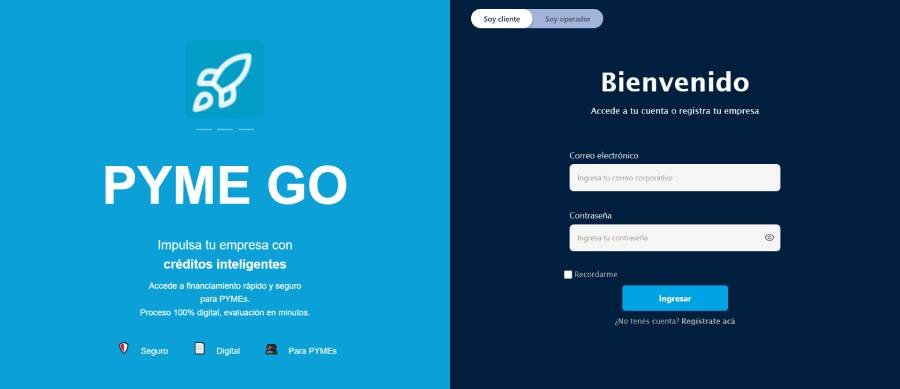
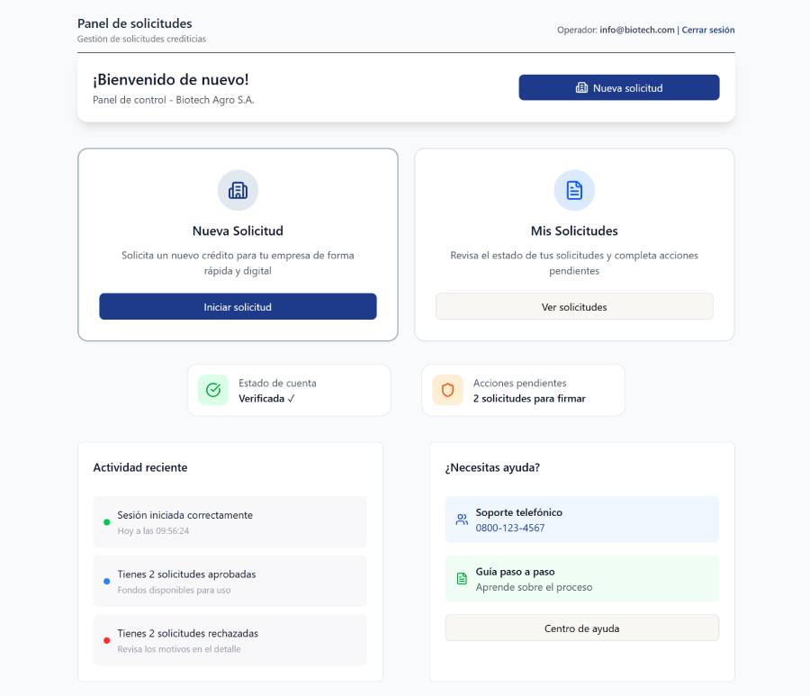
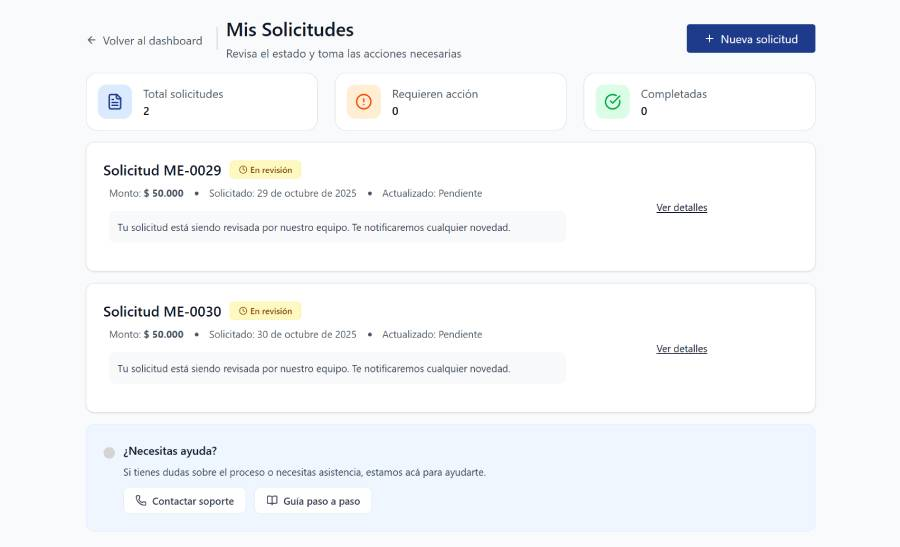
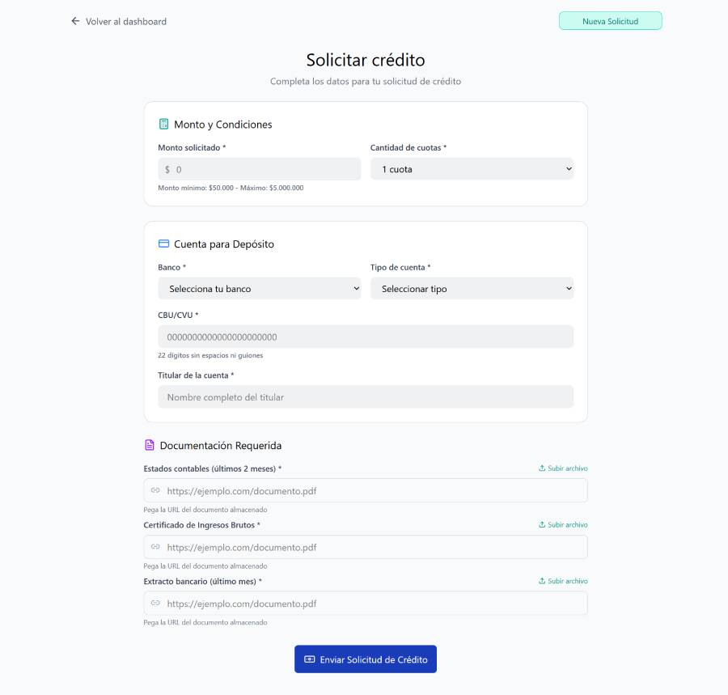
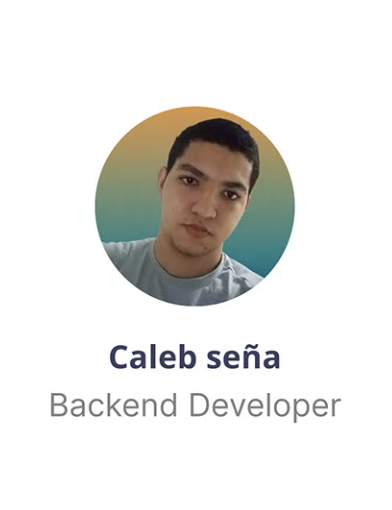
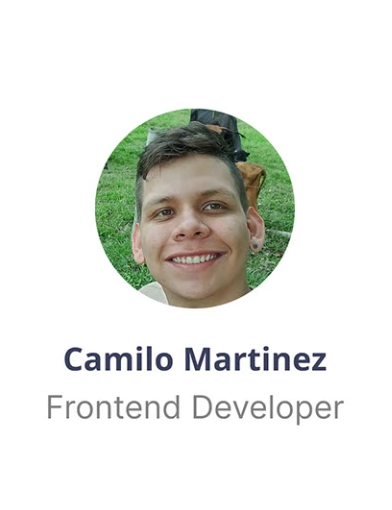
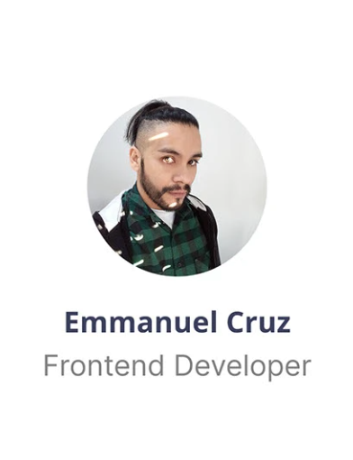

# 🚀 Pyme Go - Plataforma de Onboarding de Créditos para PYMES

<p align="center">
  <a href="https://github.com/DenverCoder1/readme-typing-svg">
    
  </a>
</p>

<br>

## 💼 Pyme Go — Plataforma Web de Onboarding de Créditos para PYMES

**Pyme Go** es una solución fintech integral diseñada para simplificar y agilizar el proceso de solicitud de créditos para pequeñas y medianas empresas. La plataforma digitaliza completamente el flujo de onboarding, desde la solicitud inicial hasta la firma digital, eliminando procesos burocráticos y reduciendo significativamente los tiempos de aprobación.

---

## 🎯 El Problema

Las PYMES enfrentan desafíos constantes al buscar financiación:

- **Procesos burocráticos lentos** que demoran semanas o meses
- **Falta de transparencia** en el estado de sus solicitudes
- **Experiencia de usuario fragmentada** con formularios complejos y múltiples puntos de contacto
- **Dificultad para cargar y gestionar documentación** requerida

---

## 💡 Nuestra Solución

**Pyme Go** permite a las PYMES solicitar créditos de forma completamente digital, con un proceso optimizado que incluye:

### Funcionalidades principales

- 📝 **Formulario dinámico inteligente**: Sistema que guarda el progreso automáticamente para continuar después
- 📄 **Carga de documentos simplificada**: Subida de archivos con validación en tiempo real
- ✍️ **Firma digital integrada**: Proceso de firma electrónica seguro y legalmente válido
- 🔔 **Seguimiento en tiempo real**: Los solicitantes pueden conocer el estado de su solicitud en cada momento
- 🔐 **Autenticación segura**: Sistema robusto de registro y login con JWT
- 👔 **Panel administrativo**: Herramientas para operadores con filtros avanzados y gestión de tareas

---

## 🎯 Objetivos y Metas

- **Reducir tiempos de aprobación** de semanas a días
- **Digitalizar completamente** el proceso de solicitud de créditos
- **Mejorar la experiencia del usuario** con interfaces intuitivas y feedback constante
- **Automatizar la recopilación y validación** de información
- **Proporcionar transparencia total** en el estado de cada solicitud

---

## 🖼️ Screenshots






---

## 🚀 Tecnologías Utilizadas

### Backend

| Componente       | Tecnología            | Descripción                               |
| ---------------- | --------------------- | ----------------------------------------- |
| ☕ Lenguaje      | Java 17               | Lenguaje de programación principal        |
| 🧩 Gestor        | Maven                 | Gestión de dependencias y construcción    |
| ⚙️ Framework     | Spring Boot 3.5.6     | Framework principal para la API REST      |
| 🌐 API REST      | Spring Web            | Exposición de endpoints RESTful           |
| 🧮 Persistencia  | Spring Data JPA       | ORM para manejo de base de datos          |
| 🗃️ Base de Datos | PostgreSQL            | Base de datos relacional                  |
| 🔐 Seguridad     | Spring Security + JWT | Autenticación y autorización segura       |
| 🧾 Validación    | Spring Validation     | Validaciones de datos en modelos          |
| 📘 Documentación | Springdoc OpenAPI     | Swagger UI para documentación interactiva |
| 🧰 Utilidades    | Lombok                | Reducción de código boilerplate           |
| 🧪 Testing       | Spring Boot Test      | Pruebas unitarias e integradas            |

**Stack Backend**: API RESTful construida con Spring Boot que gestiona usuarios, autenticación mediante JWT, y persistencia con Spring Data JPA sobre una base de datos PostgreSQL. La documentación de la API se genera automáticamente con Swagger UI (Springdoc OpenAPI).

### Frontend

| Componente      | Tecnología                 | Descripción                             |
| --------------- | -------------------------- | --------------------------------------- |
| ⚛️ Framework    | React 19                   | Librería principal para UI              |
| 🧩 Lenguaje     | TypeScript 5.8             | Tipado estático para mayor robustez     |
| ⚡ Build Tool   | Vite 7                     | Herramienta de desarrollo ultrarrápida  |
| 🎨 Estilos      | Tailwind CSS 4.1           | Framework CSS utilitario y responsive   |
| 🔄 Estado/Cache | TanStack Query 5.90        | Gestión eficiente de peticiones y caché |
| 🌐 HTTP Client  | Axios 1.12                 | Cliente para consumir la API backend    |
| 🧭 Ruteo        | React Router DOM 7.9       | Navegación y rutas protegidas           |
| 💎 Iconos       | Lucide React + React Icons | Colección de iconos modernos            |
| 🧹 Code Quality | ESLint 9 + TS ESLint       | Análisis estático y buenas prácticas    |

**Características destacadas**:

- 🔐 **Rutas protegidas** para usuarios autenticados con JWT
- 📱 **Diseño responsive** siguiendo guías de Figma
- 🦴 **Skeletons de carga** para mejor UX durante peticiones
- ♻️ **Arquitectura limpia** con componentes, hooks personalizados y gestión de estado optimizada

---

## 📋 Requisitos Previos

- Node.js 18+
- Java JDK 17+
- Maven 3.6+
- PostgreSQL 12+

---

## 🔧 Instalación Rápida (Modo Local)

### 📥 Clonación del Repositorio

```bash
git clone https://github.com/Rosariobelenn/Equipo13
cd pyme-go
```

### 📦 Backend

```bash
cd backend
mvn clean install
mvn spring-boot:run
```

El backend estará disponible en `http://localhost:8080`

### 💻 Frontend

```bash
cd frontend
npm install    # Instalar dependencias
npm run dev    # Iniciar servidor de desarrollo
```

El frontend estará disponible en `http://localhost:5173`

📝 _Se recomienda leer los archivos README de backend y frontend antes de comenzar el desarrollo, para comprender la estructura, tecnologías y flujos de trabajo del proyecto._

---

## 🌐 Demo en Producción

**Backend (Swagger UI)**:

🔗 [https://pymego.onrender.com/swagger-ui/index.html](https://pymego.onrender.com/swagger-ui/index.html)

**Frontend**:

🔗 [https://equipo13.netlify.app/](https://equipo13.netlify.app/)

---

## 🗂️ Estructura del Proyecto

```bash
pyme-go/
├── backend/         # API REST construida con Spring Boot
├── frontend/        # Interfaz web desarrollada con React + Vite + TypeScript
└── README.md        # Este archivo, con visión general del sistema
```

---

## 👥 Nuestro Equipo

### 🎨 UX/UI Design


**Tareas:**

- Investigación UX: entrevistas, encuestas, benchmark
- Arquitectura de información, User Flow, Taskflow
- Wireframes y prototipado de alta fidelidad
- Diseño UI completo en Figma

---

### ⚙️ Backend Development



**Tareas:**

- Estructura completa del proyecto backend
- Desarrollo de todos los endpoints API
- Implementación de seguridad con JWT
- Configuración de base de datos PostgreSQL
- Documentación con Swagger
- Deployment y configuración de producción

---

### 💻 Frontend Development





**Tareas:**

- Configuración inicial con Vite + React + TypeScript
- Implementación de diseño responsive con Tailwind
- Desarrollo de componentes reutilizables
- Integración con API backend
- Sistema de rutas públicas y privadas
- Gestión de estado con TanStack Query
- Optimizaciones de rendimiento

---

### 🧪 QA & Testing


**Tareas:**

- Testing funcional y exploratorio
- Ejecución y documentación de pruebas
- Elaboración de test plans
- Registro y seguimiento de incidencias
- Testing de integración frontend-backend

---

## 📄 Documentación

- [Prototipo UX/UI en Figma](https://www.figma.com/design/3lSiFZwoPb5bbSuJ6zNEoQ/Plataforma-Web-de-Onboarding-de-Cr%C3%A9ditos-para-PYMES?node-id=1-12&p=f&t=ZBs3ouofZ0gVyfYH-0)
- [Documentación de API (Swagger)](https://pymego.onrender.com/swagger-ui/index.html)

---

## 🔄 Flujo de Trabajo

El proyecto sigue la metodología ágil con sprints semanales y utiliza:

- **Git Flow** para control de versiones
- **GitHub** para colaboración y code reviews
- **CI/CD** para deployment automatizado

---

## 📄 Licencia

Este proyecto está bajo la licencia **[Apache 2.0](https://www.apache.org/licenses/LICENSE-2.0)**.

---

<p align="center">
  Hecho con 💙 por el equipo de Pyme Go
</p>
